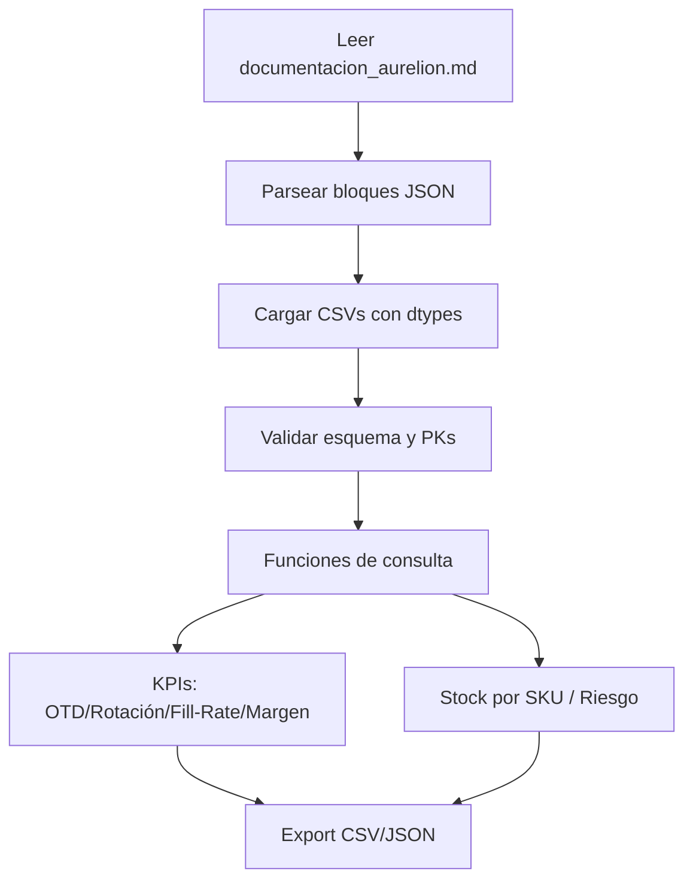

# Documentación — Aurelion

> **Versión**: 1.0 
**Fecha**: 2025-10-18
**Propósito**: insumo de referencia para un programa `.py` que deberá leer este documento y exponer información del proyecto.

---

## 1) Tema, problema y solución

**Tema:** Plataforma de retail de la tienda Aurelion, dedicada a la venta de indumentaria deportiva y accesorios.

**Problema:** Inventario desincronizado entre depósitos y e‑commerce, tiempos de reposición poco previsibles y métricas dispersas. Esto genera quiebres de stock, ventas perdidas y lead time alto para reabastecimiento.

**Solución propuesta:** Un data backbone liviano que consolida datos operativos (Productos, Stock, Ventas, Proveedores, Órdenes de Compra) y publica un set de consultas clave. El objetivo principal es:
- Disponibilidad de stock en tiempo casi real.
- Detección temprana de stock-out risk por SKU (identificador).
- Métricas operativas listas para visualización (OTD, rotación, margen, fill‑rate).

**KPIs iniciales:**
- **OTD** (*On‑Time Delivery*): objetivo ≥ 95%.
- **Rotación mensual** por SKU.
- **Fill‑Rate** por orden: objetivo ≥ 97%.
- **Tiempo de reposición** promedio por proveedor.

---

## 2) Dataset de referencia

### 2.1 Fuente
| Archivo                 | Descripción                                                             | Origen                                    |
| ----------------------- | ----------------------------------------------------------------------- | ----------------------------------------- |
| **productos.xlsx**      | Catálogo maestro de productos disponibles en la tienda.                 | Sistema interno de gestión de inventario. |
| **ventas.xlsx**         | Registro de ventas diarias con información del cliente y medio de pago. | Módulo de facturación / POS.              |
| **detalle_ventas.xlsx** | Detalle de cada línea de venta (producto, cantidad e importe).          | Export del ERP.                           |
| **clientes.xlsx**       | Base maestra de clientes con fecha de alta y ubicación.                 | CRM de la tienda.                         |


### 2.2 Definición (entidades)
- **Producto (id_producto):** artículo único en el catálogo de Aurelion.
- **Venta (id_venta):** operación comercial registrada.
- **Detalle de Venta (id_venta, id_producto):** relación entre ventas y productos (1:N).
- **Cliente (id_cliente):** persona o entidad asociada a una venta.

### 2.3 Estructura, tipos y escala

```json
{
  "productos": {
    "file": "productos.xlsx",
    "primary_key": ["id_producto"],
    "rows": 100,
    "fields": {
      "id_producto": "int64",
      "nombre_producto": "string",
      "categoria": "string",
      "precio_unitario": "float64"
    }
  },
  "clientes": {
    "file": "clientes.xlsx",
    "primary_key": ["id_cliente"],
    "rows": 100,
    "fields": {
      "id_cliente": "int64",
      "nombre_cliente": "string",
      "email": "string",
      "ciudad": "string",
      "fecha_alta": "datetime64[ns]"
    }
  },
  "ventas": {
    "file": "ventas.xlsx",
    "primary_key": ["id_venta"],
    "rows": 120,
    "fields": {
      "id_venta": "int64",
      "fecha": "datetime64[ns]",
      "id_cliente": "int64",
      "nombre_cliente": "string",
      "email": "string",
      "medio_pago": "string"
    }
  },
  "detalle_ventas": {
    "file": "detalle_ventas.xlsx",
    "primary_key": ["id_venta", "id_producto"],
    "rows": 343,
    "fields": {
      "id_venta": "int64",
      "id_producto": "int64",
      "nombre_producto": "string",
      "cantidad": "int64",
      "precio_unitario": "float64",
      "importe": "float64"
    }
  }
}
```

### 2.4 Escala y granularidad del dataset
| Entidad            | Registros | Observaciones clave                                         |
| ------------------ | --------- | ----------------------------------------------------------- |
| **productos**      | 100       | Cada producto tiene categoría y precio unitario definidos.  |
| **clientes**       | 100       | Datos básicos más fecha de alta para análisis de retención. |
| **ventas**         | 120       | Promedio de 1,4 líneas por venta.                          |
| **detalle_ventas** | 343       | Incluye desglose por producto, cantidad e importe.          |


---

## 3) Información, pasos, pseudocódigo y diagrama del programa

### 3.1 Objetivo del programa (aurelion_info.py)
El programa debe leer los archivos de datos reales (productos.xlsx, ventas.xlsx, detalle_ventas.xlsx, clientes.xlsx) y permitir obtener información consolidada sobre el negocio.
Su propósito es centralizar consultas clave de ventas y clientes, entregando métricas operativas listas para análisis o visualización.

### 3.2 Funcionalidades esperadas
**Lectura y validación:** cargar cada dataset y verificar que existan las columnas esperadas. Validar claves primarias (id_producto, id_venta, id_cliente). Verificar integridad referencial (por ejemplo, que cada id_cliente en ventas exista en clientes).

**Consultas principales:**
- `get_top_productos(n=5)`: devuelve los productos más vendidos (por cantidad).
- `get_ticket_promedio()`: calcula el importe promedio por venta.
- `get_ventas_por_ciudad()`: agrupa ventas según la ciudad del cliente.
- `get_medio_pago_ratio()`: porcentaje de ventas por tipo de medio de pago.
- `get_clientes_nuevos(meses=6)`: filtra clientes con fecha_alta reciente.

**Indicadores globales (KPIs):** total de ventas, cantidad total de productos vendidos y número de clientes activos. Ticket promedio y dispersión de precios. Ranking de categorías más vendidas.
**Exportación:** resultados exportados a la carpeta ./salidas/ en formato .csv y .json.

### 3.3 Pseudocodigo
El programa inicia cargando los cuatro archivos principales del sistema: `productos.xlsx`, `clientes.xlsx`, `ventas.xlsx` y `detalle_ventas.xlsx`.
Cada uno de estos datasets es validado para asegurar que contenga las columnas esperadas y que las claves primarias no se repitan.
Una vez verificada la estructura, el sistema realiza un cruce de información entre las tablas:
Se vinculan los clientes con las ventas mediante el campo `id_cliente`.
Se relacionan las ventas con el detalle de ventas a través de `id_venta`.
Y finalmente, el detalle se asocia con los productos por medio de `id_producto`.
Con los datos integrados, el programa procede a calcular los principales indicadores de desempeño (KPIs):
- Total de ventas realizadas.
- Ticket promedio de compra.
- Productos más vendidos.
- Distribución de ventas por ciudad y medio de pago.

Luego, se generan consultas específicas que permiten obtener información puntual, como los clientes nuevos en los últimos meses o las categorías con mayor rotación de productos.
Una vez calculados los resultados, el programa exporta automáticamente los archivos generados (en formato `.csv` y `.json`) dentro del directorio ./salidas/.
Cada archivo mantiene una nomenclatura descriptiva para facilitar su posterior análisis o visualización en dashboards externos.
Finalmente, el proceso concluye mostrando en consola un resumen de ejecución con el estado de carga de cada dataset, la cantidad de registros procesados y la ubicación de los archivos exportados.

### 3.4 Diagrama (mermaid)



---

## 4) Sugerencias y mejoras aplicadas con Copilot

- **Tipado explícito** de columnas para evitar *dtype drift* en pandas.
- **Validadores** automáticos de PK/duplicados y presencia de columnas críticas (`sku`, `cantidad`, `fecha`).
- **Funciones puras** y testeables (I/O en capa separada).
- **Parámetros configurables**: rutas, *refresh rate*, umbral de riesgo, ventana de demanda.
- **Logs estructurados** (`logging` con `JSONFormatter`) y *feature flags* para cálculos pesados.
- **Mermaid** embebido para mantener el *single source of truth* del flujo.
- **Hooks de calidad**: `black`, `ruff`, `pytest -q`, *pre-commit* (sugeridos).

---

## 5) Consideraciones y supuestos

- Fechas en **ISO‑8601** (`YYYY-MM-DDTHH:MM:SS-03:00`).  
- Moneda: **ARS**; impuestos incluidos en `precio_lista`, `iva` como porcentaje decimal.  
- Ventas canceladas y devueltas **no** computan en rotación ni margen.  
- Para `fill‑rate`: cantidad recepcionada / cantidad total comprometida por OC.  
- Para `OTD`: recepciones en o antes de `fecha_prometida` / total de OCs recepcionadas.
